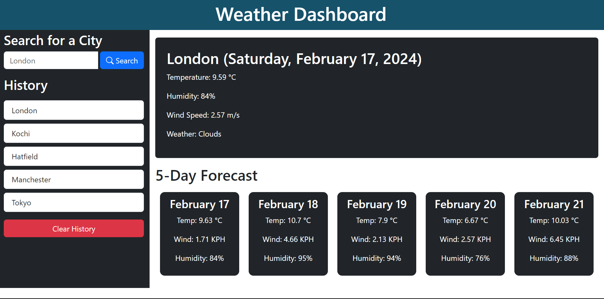

## Weather Dashboard 

## Description

This project aims to develop a user-friendly web application that functions as a weather dashboard. Users can search for the weather forecast of various cities and view both current and future weather conditions in a single, convenient interface.

Image Showing Home Page of application.

**Functionality:**

-  Users can enter the name of a city in a search bar.
-  Upon searching, the application retrieves and displays the current weather information for that city, including:
   -  City name
   -  Date
   -  Weather icon
   -  Temperature
   -  Humidity
   -  Wind speed
-  Additionally, a 5-day forecast for the searched city is presented, displaying:
   -  Date
   -  Weather icon
   -  Temperature
   -  Humidity
-  Search history is maintained, allowing users to easily revisit previously searched cities and view their weather information without re-entering the city name.

### Technologies Used

-  HTML
-  CSS
-  JavaScript
-  OpenWeatherMap API

### Getting Started

1. Clone this repository.
2. Open the `index.html` file in your browser.

## Contributing

Feel free to contribute to the success of this project. Follow these guidelines:

1. Fork the repository.
2. Create a new branch for your feature or bug fix.
3. Commit your changes.
4. Push to your branch.
5. Submit a pull request.

## Credits

The following articles and websites are used as references for this particular project.

[Professional README Guide](https://coding-boot-camp.github.io/full-stack/github/professional-readme-guide)

[JavaScript](https://developer.mozilla.org/en-US/docs/Web/JavaScript)

[JQuery](https://jquery.com/)

## Deployment Page Link

[Weather Dashboard](https://anjalsali.github.io/weather-dashboard/)
